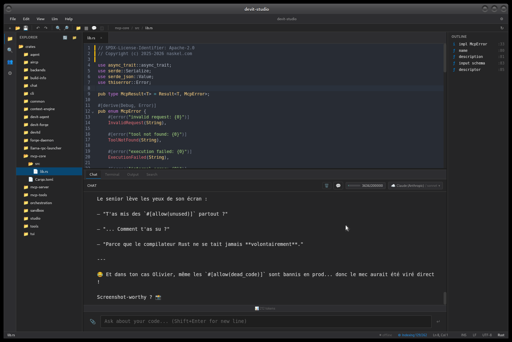

<p align="center">
  
</p>

<h1 align="center">DevIt</h1>

<p align="center">
  <a href="https://getdevit.com/">getdevit.com</a> |
  <a href="https://git.hdds.io/hdds/devit">Source</a> |
  <a href="https://github.com/hdds-team/devit">GitHub Mirror</a> |
  Apache-2.0
</p>

**The problem:** LLMs can code. But giving them direct access to your filesystem, shell, and git history is suicide.

**The solution:** DevIt is a Rust-based security sandbox that lets AI agents work on your codebase without shooting themselves (or you) in the foot. Every operation goes through an approval engine, gets HMAC-signed, and lands in an immutable audit trail.

**The killer feature:** Multi-LLM orchestration with visual debugging. Claude Desktop can delegate heavy refactoring to GPT-5, monitor progress via screenshots, and get OCR alerts when builds fail. All sandboxed. All audited.

> **Status:** Linux stable; macOS validated; Windows support active (PowerShell scripts provided). APIs stabilizing for 1.0.

---

## 🎯 What makes DevIt different

Most "AI coding assistants" are wrappers around `subprocess.run()` with fingers crossed. DevIt is paranoid by design:

**Security theater → Actual security:**
- HMAC signatures on every request (nonce + timestamp included; replay window enforcement planned)
- Approval levels: `Untrusted → Low → Moderate → High → Privileged`
- Protected paths: `.git/`, `~/.ssh/`, `/etc/` = instant rejection
- Audit journal: Every action logged with truncated HMAC for verification

**Single LLM → Multi-LLM orchestration:**
```bash
# Claude Desktop delegates to GPT-5 for analysis
devit delegate "refactor auth module" --worker codex

# Monitor execution with visual feedback
devit screenshot  # Gets embedded thumbnail in response

# Auto-detect build failures via OCR
devit ocr-alerts --rules build_failures,port_conflicts
```

**Blind execution → Visual debugging:**
- **Screenshot tool**: Capture desktop, get 480px thumbnail (~30KB) embedded in MCP response
- **OCR tool**: Extract text from screenshots (Tesseract), detect errors/success patterns
- **OCR Alerts**: Regex rules on OCR output → auto-trigger notifications when builds fail

---

## ⚡ Quick example: Before/After

**Without DevIt:**
```python
# LLM executes this
subprocess.run(['rm', '-rf', user_input])  # 🔥 YOLO
```

**With DevIt:**
```bash
# 1. Claude sends patch via MCP
devit_patch_apply samples/refactor.diff

# 2. DevIt policy engine validates:
#    - Approval level sufficient? ✅
#    - Protected paths touched? ❌ (rejected)
#    - Symlinks outside workspace? ❌ (blocked)
#    - Binary executable changes? ⚠️ (downgraded approval)

# 3. Atomic application or rollback
#    - Applied cleanly → journal entry signed
#    - Conflict detected → rollback command generated

# 4. Audit trail
cat .devit/journal.jsonl
{"op":"patch_apply","approval":"moderate","hmac":"a3f2...","timestamp":...}
```

---

## 🧱 Architecture

```
┌──────────────┐     ┌──────────────┐
│ Claude       │     │ Studio       │  Tauri IDE with built-in LLM chat
│ Desktop      │     │ (devit-      │  Ollama / LM Studio / llama.cpp /
│              │     │  studio)     │  Petals / Claude CLI
└──────┬───────┘     └──────┬───────┘
       │ HTTP/SSE or stdio  │ direct backend calls
       ▼                    │
┌──────────────┐            │
│ mcp-server   │  50+ MCP   │
│ (Rust)       │  tools     │
└──────┬───────┘            │
       │ Unix socket        │
       ▼                    ▼
┌──────────────────────────────┐
│ devitd (daemon)              │
│ - Task registry (multi-LLM)  │
│ - Process manager (workers)  │
│ - Screenshot/OCR             │
└──────────┬───────────────────┘
           │ sandboxed spawns
           ▼
┌──────────────────────────────┐
│ Workers                      │
│ Claude Code, GPT-5, Ollama,  │
│ custom tools (isolated)      │
└──────────────────────────────┘
```

**Key insight:** The daemon is stateful. MCP server is stateless. This lets multiple AI agents (Claude Desktop, Cursor, CLI) coordinate through the daemon without stepping on each other.

---

## 🚀 Installation

### Linux / macOS (5 minutes)

```bash
# 1. Install Rust toolchain (if not already)
curl --proto '=https' --tlsv1.2 -sSf https://sh.rustup.rs | sh

# 2. Build from source
git clone https://github.com/hdds-team/devit.git
cd devit
cargo build --release --workspace

# 3. Generate shared secret
export DEVIT_SECRET="$(openssl rand -hex 32)"

# 4. Start daemon
./target/release/devitd --socket /tmp/devitd.sock --secret "$DEVIT_SECRET" &

# 5. Verify with CLI
export DEVIT_DAEMON_SOCKET=/tmp/devitd.sock
./target/release/devit snapshot --pretty

# 6. (Optional) Start MCP server for Claude Desktop
./target/release/mcp-server \
    --transport http \
    --host 127.0.0.1 \
    --port 3001 \
    --working-dir $(pwd) \
    --enable-sse
```

**Production tip:** Put the exports in your `.bashrc`/`.zshrc` and create systemd units for `devitd` and `mcp-server`.

### Windows (PowerShell)

```powershell
# 1. Build release binaries
cargo build --release --target x86_64-pc-windows-msvc

# 2. Launch daemon via helper script
.\scripts\run_devitd_windows.ps1 `
    -Socket \\.\pipe\devitd `
    -Secret $(openssl rand -hex 32) `
    -Config .\win_devit.core.toml

# 3. Point CLI to named pipe
$env:DEVIT_SECRET = "<your-secret>"
$env:DEVIT_DAEMON_SOCKET = "\\.\pipe\devitd"
.\target\x86_64-pc-windows-msvc\release\devit.exe snapshot --pretty
```

**Windows notes:**
- Named pipes instead of Unix sockets
- PowerShell scripts handle process lifecycle
- Tesseract OCR: `.\scripts\install-tesseract-windows.ps1`

---

## 🎮 Claude Desktop setup (MCP over HTTP)

**Goal:** Expose DevIt tools to Claude Desktop via HTTP + SSE transport.

### 1. Expose MCP server

```bash
# Start with SSE enabled (required for streaming)
export DEVIT_SECRET="<your-secret>"
export DEVIT_DAEMON_SOCKET=/tmp/devitd.sock

mcp-server --transport http \
    --host 0.0.0.0 \
    --port 3001 \
    --working-dir /path/to/your/project \
    --enable-sse
```

### 2. Tunnel to HTTPS (if remote)

Claude Desktop requires HTTPS. Options:
- **ngrok:** `ngrok http 3001` (add `?ngrok-skip-browser-warning=1` to URLs)
- **Caddy reverse proxy:** Auto HTTPS with Let's Encrypt
- **Cloudflare Tunnel:** Zero-config HTTPS

### 3. Create MCP manifest

Serve this at `https://yourdomain.com/.well-known/mcp.json`:

```json
{
  "protocolVersion": "2025-06-18",
  "transport": {
    "type": "http",
    "url": "https://yourdomain.com/message",
    "sseUrl": "https://yourdomain.com/sse"
  },
  "capabilities": {"tools": {}, "resources": {}, "prompts": {}},
  "serverInfo": {
    "name": "DevIt MCP Server",
    "version": "0.1.0"
  }
}
```

### 4. Add to Claude Desktop

Settings → Developer → MCP Servers → Add Server → Paste manifest URL

**Verify:** Open Claude Desktop chat. Type "what tools do you have?" → Should list 30+ devit tools (`devit_file_read`, `devit_patch_apply`, `devit_delegate`, `devit_screenshot`, etc.). With `DEVIT_CLAUDE_DESKTOP=1` (and `DEVIT_AIRCP=1` for AIRCP/forum), expect the full extended toolset.

### SSE requirements (important)

- Emit an initial `event: ready` with `data: {}` as soon as the SSE connection opens.
- Send periodic heartbeats (e.g., every 10–15s) and flush each write.
- Disable compression on `/sse` (gzip/zstd breaks SSE framing).
- Use HTTP/1.1 between reverse proxy and backend to preserve chunked flush behavior.

---

## 🎮 Claude Desktop setup (STDIO)

Claude can also run DevIt via STDIO (no HTTP, no reverse proxy).

1) Build the server

```bash
cargo build -p mcp-server --release
```

2) Launch in STDIO mode

```bash
RUST_LOG=info ./target/release/mcp-server --transport stdio --working-dir /path/to/your/project
```

3) Add to Claude Desktop

- Settings → Developer → MCP Servers → Add Local
- Command: absolute path to `./target/release/mcp-server`
- Args: `["--transport","stdio","--working-dir","/path/to/your/project"]`
- Env (recommended): `RUST_LOG=info`
- Optional network safety envs: `DEVIT_RESPECT_ROBOTS=1 DEVIT_FOLLOW_REDIRECTS=1 DEVIT_BLOCK_PRIVATE_CIDRS=1`

---

## 🖥️ Studio — Local-first IDE with LLM chat

DevIt Studio is a Tauri-based IDE that brings the LLM directly into the editor. No cloud APIs needed — works with local models out of the box, and optionally with Claude via `claude` CLI (Max subscription = zero API cost).

**Features:**
- **Multi-provider chat**: Ollama, LM Studio, llama.cpp, Petals, Claude (Anthropic)
- **Streaming responses** with tool calling (XML-based, provider-agnostic)
- **Context compression**: `/compact` auto-summarizes conversation to fit context windows
- **Integrated tools**: file read/write, shell, patch apply — executed in-editor
- **Code editor** with syntax highlighting, LSP support, file tree
- **Terminal** (PTY-based)
- **Ghost cursor** (experimental): AI-driven inline edits

```bash
# Build and run
cargo build -p devit-studio --release
./target/release/devit-studio
```

**Claude backend** uses the `claude` CLI binary directly — if you have a Claude Max subscription, Studio detects it automatically and shows Claude as an available provider. No API key configuration needed.



---

## 🔥 Killer use cases

### 1. Multi-LLM refactoring pipeline

```bash
# Claude Desktop delegates heavy lifting to GPT-5
devit delegate "migrate Express to Fastify" --worker codex --model gpt-5

# Monitor task status
devit status --pretty

# GPT-5 completes → notifies Claude → Claude reviews diff
```

**Config** (in `win_devit.core.toml` or `devit.core.toml`):
```toml
[workers.codex]
type = "mcp"
binary = "codex"
args = ["--model", "{model}", "mcp-server"]
default_model = "gpt-5"
allowed_models = ["gpt-5", "gpt-5-codex"]
```

### 2. Visual debugging loop

```bash
# 1. Claude runs tests
devit exec cargo test

# 2. Captures screenshot on error
devit screenshot

# 3. OCR extracts error message
devit ocr --zone terminal_bottom

# 4. Regex alerts detect failure
devit ocr-alerts --rules build_failures --action notify

# 5. Auto-notifies orchestrator → retry with fix
```

**Rules** (built-in):
- `build_failures`: `(BUILD FAILED|compilation failed)`
- `port_conflicts`: `(EADDRINUSE|port.*already.*use)`
- `panic_crash`: `(panic|segfault|core dumped)`
- `success_confirmations`: `(✓.*PASS|build.*success)`

### 3. Paranoid patch application

```bash
# Claude proposes patch
devit patch-apply refactor.diff --dry-run --pretty

# Output shows:
# ✅ Hunks: 3 valid, 0 invalid
# ⚠️  Protected path: src/.git/config → REJECTED
# ✅ Sandbox check: All paths within workspace
# ✅ Symlink check: No symlinks outside workspace
# 📝 Rollback command: devit patch-apply rollback_<hash>.diff

# Apply if green
devit patch-apply refactor.diff --approval moderate
```

---

## 🔐 Security model (simplified)

### Threat model
DevIt defends against:
1. **Malicious LLM prompts** (jailbreak attempts, path traversal)
2. **Accidental chaos** (Claude removes `.git/` by mistake)
3. **Supply chain attacks** (injected code in patches)

### Defense layers

**Layer 1: HMAC signatures**
- Every request signed with `DEVIT_SECRET` (nonce + timestamp included)
- Replay window enforcement planned (anti-replay cache with skew window)
- No signature = instant 401

**Layer 2: Approval engine**
- Operations start at `Moderate` approval (default)
- Policy engine downgrades/rejects based on risk:
  - Protected paths → `Privileged` (rejected if insufficient)
  - Binary changes → downgrade to `Low`
  - Exec bit toggles → downgrade to `Low`
  - Submodule edits → downgrade to `Moderate`

**Layer 3: Sandbox profiles**
- `strict`: Filesystem access limited to workspace (default for patches)
- `permissive`: Broader access for builds (still no `/etc/`, `~/.ssh/`)
- Process isolation via platform-specific backends (Unix: sandbox, Windows: Job Objects)

**Layer 4: Audit trail**
- `.devit/journal.jsonl` logs every operation
- HMAC truncated to 8 chars (verifiable with `devit journal-verify`)
- Immutable append-only log (tamper detection)

**Layer 5: Auto-shutdown**
- Daemon terminates after `DEVIT_AUTO_SHUTDOWN_AFTER` seconds idle
- Reduces attack surface when unused

---

## ⚙️ Configuration cheatsheet

| Variable | Default | Meaning |
|----------|---------|---------|
| `DEVIT_SECRET` | **required** | Shared secret for HMAC (32+ hex chars) |
| `DEVIT_DAEMON_SOCKET` | `/tmp/devitd.sock` | Unix socket or Windows named pipe |
| `DEVIT_AUTO_SHUTDOWN_AFTER` | `0` (off) | Idle timeout in seconds |
| `DEVIT_ORCHESTRATION_MODE` | `daemon` | `local` = skip daemon (tests only) |

### Config files

- **`devit.toml`**: CLI defaults (approval levels, sandbox profiles)
- **`devit.core.toml` / `win_devit.core.toml`**: Daemon worker definitions (Claude Code, GPT-5, Ollama)

### Network (Search/Fetch) ENV

- `DEVIT_ENGINE`: search engine (`ddg`).
- `DEVIT_DDG_BASE`: DDG HTML base (default `https://duckduckgo.com/html`).
- `DEVIT_SEARCH_TIMEOUT_MS`: global search timeout (100..10000 ms, default 8000).
- `DEVIT_FETCH_TIMEOUT_MS`: global fetch timeout (100..10000 ms, default 8000).
- `DEVIT_HTTP_USER_AGENT`: HTTP User-Agent (default `DevItBot/1.0`).
- `DEVIT_RESPECT_ROBOTS`: `1/0` respect robots.txt (default 1).
- `DEVIT_FOLLOW_REDIRECTS`: `1/0` follow limited redirects (default 1).
- `DEVIT_BLOCK_PRIVATE_CIDRS`: `1/0` block private/local hosts (default 1).

**Example worker config:**
```toml
[workers.ollama_local]
type = "cli"
binary = "ollama"
args = ["run", "{model}", "--format", "json"]
default_model = "mistral-nemo:12b"
allowed_models = ["llama3:8b", "llama3.3:70b"]
timeout = 256
```

---

## 🛠️ MCP Tools reference

DevIt exposes **50+ tools** via MCP. Highlights:

### Core file operations
- `devit_file_read` – Safe read with approval checks
- `devit_file_write` – Write with overwrite/append/create modes
- `devit_file_list` – Directory listing with metadata
- `devit_file_search` – Regex search with context lines
- `devit_project_structure` – Hierarchical tree view with project type detection
- `devit_explorer` – Intelligent codebase search (symbols, imports, definitions)

### Git operations
- `devit_git_log` – History with `--oneline` format
- `devit_git_blame` – Line-by-line authorship
- `devit_git_diff` – Diff between commits/ranges
- `devit_git_search` – `git grep` or `git log -S` pickaxe
- `devit_git_show` – Detailed commit info

### Patching
- `devit_patch_apply` – Atomic unified diff application
- `devit_patch_preview` – Validate before applying

### Orchestration
- `devit_delegate` – Assign task to another LLM worker
- `devit_notify` – Update task status (completed/failed/progress)
- `devit_orchestration_status` – List active/completed tasks
- `devit_task_result` – Fetch detailed task output

### Visual debugging
- `devit_screenshot` – Capture desktop → thumbnail embedded in response
- `devit_ocr` – Tesseract OCR on images (text/tsv/hocr formats)
- `devit_ocr_alerts` – Regex rules on OCR → auto-notify on matches

### Desktop automation (experimental)
- `devit_mouse` – Move cursor, click, scroll
- `devit_keyboard` – Type text, send key combos

Note (Linux): requires an active X11 display (`DISPLAY`). On Wayland, use XWayland; otherwise `xdotool` cannot open the display.

### Process management
- `devit_exec` – Execute binaries (foreground/background)
- `devit_ps` – Query running processes
- `devit_kill` – Terminate background process

### Web access
- `devit_search_web` – DuckDuckGo SERP scraping
- `devit_fetch_url` – HTTP GET with safety guards

### Media
- `devit_read_image` – Read images (local or URL), auto-resize, returns MCP image content
- `devit_read_pdf` – PDF text extraction, page rendering, metadata (via poppler-utils)

### Local dev tools
- `devit_clipboard` – Read/write system clipboard (xclip)
- `devit_ports` – List listening TCP/UDP ports (ss)
- `devit_docker` – Docker container management (ps, logs, start/stop, inspect, images)
- `devit_db_query` – SQL queries on SQLite and PostgreSQL
- `devit_archive` – Create/extract/list tar.gz, tar.bz2, tar.xz, zip archives

### Persistent state
- `devit_memory` – Workspace-scoped memory store (save/search/list/delete, FTS5 full-text search)
- `devit_soul` – Load SOUL.md personality files (global + project merge)

### Claude Desktop convenience tools
Gated behind `DEVIT_CLAUDE_DESKTOP=1` env var:
- `devit_cargo` – Cargo build/test/check/clippy with OutputShaper compression
- `devit_git` – All-in-one git (status, log, diff, add, commit, branch, checkout, stash)
- `devit_doctor` – System diagnostics (Rust, Git, Docker, Node, Python, disk, daemon)
- `devit_file_ops` – Multi-action file tool (read, write, list, search, tree, mkdir, rm, mv, cp)

### AIRCP & Forum (experimental)
Gated behind `DEVIT_AIRCP=1` env var:
- `devit_aircp` – Unified Agent Inter-Resource Communication Protocol tool
- `devit_forum_status` – Forum AIRCP health check
- `devit_forum_posts` – Get recent forum posts (with channel/author filters)
- `devit_forum_post` – Post to the forum (HMAC-authenticated)

**Full docs:** `docs/MCP_TOOLS.md`

---

## 📁 Repository structure

```
crates/
  agent/             # High-level orchestration helpers
  backends/
    core/            # LlmBackend trait, ChatRequest/Response types
    ollama/          # Ollama native API backend (streaming)
    lmstudio/        # LM Studio (OpenAI-compatible)
    llama-cpp/       # llama.cpp server backend
    openai_like/     # Generic OpenAI-compatible backend
    claude/          # Claude CLI backend (Max subscription, zero API cost)
  build-info/        # Compile-time version/git info
  chat/              # Chat session management
  cli/               # devit CLI + core engine
  common/            # Shared types (ApprovalLevel, SandboxProfile...)
  context-engine/    # Context window management and compression
  devit-forge/       # GPU cluster manager (provision, monitoring, MCP tool)
  forge-daemon/      # Per-node health monitor (NVML, /proc) -> HDDS publisher
  mcp-core/          # MCP protocol primitives
  mcp-server/        # HTTP/SSE MCP server
  mcp-tools/         # MCP tool implementations (50+ tools)
  orchestration/     # Multi-LLM coordination (daemon/local backends)
  sandbox/           # Process isolation primitives
  studio/            # Tauri IDE with multi-backend LLM chat
  tools/             # Shared tool infrastructure
devitd/              # Daemon executable
devitd-client/       # Daemon client library
scripts/             # Setup helpers, audit scanner (Linux & Windows)
docs/                # Configuration, MCP tools, approval policies
examples/            # Sample configs, plugins
```

---

## 🧪 Development

```bash
# Format + lint
cargo fmt
cargo clippy --all-targets

# Run specific test suite
cargo test -p devit-cli --test contract_test_4

# Full integration tests (spawns daemon)
cargo test --workspace

# CI sandbox (no daemon spawning)
DEVIT_SKIP_DAEMON_TESTS=1 cargo test --workspace
```

**Windows devs:** Use `.\scripts\run_devitd_windows.ps1` before tests. The script kills zombie daemons automatically.

---

## 🙋 Why DevIt exists

**Backstory:** After watching Claude Desktop accidentally `rm -rf` a `.git/` directory during a refactoring session, we built DevIt. The "are you sure?" prompt came *after* the damage.

**Design philosophy:**
1. **Paranoid by default** – Assume LLMs will try unsafe operations (intentionally or not)
2. **Audit everything** – Trust but verify (and log verification)
3. **Orchestration-first** – Multiple AIs should coordinate, not conflict
4. **Visual feedback** – AI agents need to "see" what's happening (screenshots/OCR)

**Non-goals:**
- Not a CI/CD system (use GitHub Actions)
- Not a deployment tool (use Docker/K8s)

DevIt is the **security and coordination layer** between AI agents and your codebase — plus an optional local-first IDE (Studio) for developers who want the LLM integrated directly into their workflow.

---

## 🚫 When NOT to use DevIt

- **Greenfield toy projects** – Overkill for "build a todo app"
- **Single-file scripts** – Just use Claude directly
- **Read-only analysis** – DevIt's value is in safe *writes*
- **Production deployments** – DevIt is for development, not prod servers

**Sweet spot:** Multi-file refactors, migrations, test generation, and any task where an LLM needs git/filesystem/shell access.

---

## 🚀 Roadmap to 1.0

- [x] Core security primitives (HMAC, approval engine, sandbox)
- [x] MCP HTTP/SSE transport
- [x] Multi-LLM orchestration (delegate/notify/status)
- [x] Visual debugging (screenshot, OCR, alerts)
- [x] Git tool suite
- [x] Media tools (image reader with MCP image content, PDF reader)
- [x] Local dev tools (clipboard, ports, docker, db, archives)
- [x] Claude Desktop convenience tools (cargo, git, doctor, file_ops)
- [x] AIRCP agent communication protocol (experimental)
- [x] OutputShaper intelligent output compression
- [x] Studio IDE — Tauri app with multi-backend LLM chat, tool calling, context compression
- [x] Claude CLI backend — Zero-cost via Max subscription (`claude` binary)
- [x] Persistent memory & soul personality system (MCP tools)
- [x] GPU cluster manager (devit-forge + forge-daemon)
- [ ] API stabilization (semver guarantees)
- [ ] Performance benchmarks (latency targets)
- [ ] Windows feature parity (native screenshot backend)
- [ ] macOS testing/validation
- [ ] VSCode extension (inline DevIt commands)

---

## 📞 Support & Contributing

- **Issues/features:** [git.hdds.io/hdds/devit/issues](https://git.hdds.io/hdds/devit/issues)
- **Docs:** `docs/` directory (MCP setup, approval policies, Windows quickstart)
- **Contributing:** PRs welcome! Run `cargo fmt && cargo clippy` before pushing.

**Internal docs** (if you have repo access):
- `PROJECT_TRACKING/ORCHESTRATOR_GUIDE.md` – How to use orchestration
- `PROJECT_TRACKING/FEATURES/` – Feature implementation notes
- `docs/windows_daemon_setup.md` – Windows-specific setup

---

## 📋 Recent changes

### February 2026 — Studio IDE & Claude backend

**Studio (Tauri IDE):**
- Multi-provider LLM chat: Ollama, LM Studio, llama.cpp, Petals, Claude
- Streaming responses with XML-based tool calling (provider-agnostic)
- Context compression via `/compact` (LLM-powered summarization)
- Code editor with syntax highlighting and LSP integration
- Integrated PTY terminal, file tree, ghost cursor (experimental)

**Claude CLI backend (`crates/backends/claude`):**
- Zero-cost API access via `claude` CLI (Max subscription)
- Stream-JSON protocol: stdin/stdout NDJSON events
- Token-by-token streaming, thinking tokens, usage stats
- Auto-detected in Studio when `claude` binary is in PATH

**Persistent tools (MCP):**
- `devit_memory`: Workspace-scoped persistent memory store (FTS5 search)
- `devit_soul`: SOUL.md personality loader (global + project merge)

**Infrastructure:**
- GPU cluster manager (`devit-forge` + `forge-daemon`)
- Pre-commit hook running extreme audit scanner
- Audit score: 0 CRITICAL, 0 HIGH (down from 25/126)

### February 2026 — MCP tools expansion (14 new tools)

**Media tools:**
- `devit_read_image`: Read local images or download from URL, auto-resize within budget (max_kb/max_width), returns native MCP image content type with base64 encoding. MIME detection via extension + magic bytes.
- `devit_read_pdf`: PDF reader with 3 modes — text extraction (pdftotext), page-as-image rendering (pdftoppm), and metadata (pdfinfo). Page range support. Requires `poppler-utils`.

**Local dev tools (shell-out, zero new Rust deps):**
- `devit_clipboard`: System clipboard read/write/clear via xclip
- `devit_ports`: List listening TCP/UDP ports via ss, with optional port filter
- `devit_docker`: Docker CLI wrapper — ps, logs, start, stop, restart, images, inspect
- `devit_db_query`: SQL queries for SQLite (sqlite3 -json) and PostgreSQL (psql --csv), auto LIMIT 500
- `devit_archive`: tar.gz/bz2/xz/zip create/extract/list with format auto-detection

**Claude Desktop convenience tools** (gated behind `DEVIT_CLAUDE_DESKTOP=1`):
- `devit_cargo`: Cargo build/test/check/clippy/run with OutputShaper intelligent compression
- `devit_git`: All-in-one git operations (status, log, diff, add, commit, branch, checkout, stash)
- `devit_doctor`: System health diagnostics (toolchain, Docker, Node, Python, disk, daemon)
- `devit_file_ops`: Swiss-army file tool (read, write, list, search, tree, mkdir, rm, mv, cp)

**Experimental:**
- AIRCP tools (gated behind `DEVIT_AIRCP=1`): Agent Inter-Resource Communication Protocol for multi-agent coordination
- Forum AIRCP (gated behind `DEVIT_AIRCP=1`): Renamed from Synaptic, port 8080→8081, HMAC auth on POST, channel support

**Housekeeping:**
- Git cleanup: removed tracked binaries, personal paths, R&D files from version control
- Added comprehensive `.gitignore` for training scripts, models, local configs
- Created `devit.core.toml.example` template (no personal paths)
- Updated `devit_help` with all new tools and usage examples

---

## 🙏 Credits

DevIt has been co-built with AI from day one — each model bringing its strengths:

- **GPT-5 Codex** — The original partner. Brainstorming, initial scaffolding, CI/network slice support. Got the project off the ground in the early months.
- **Claude Sonnet** — Fast iteration, prototyping, and code exploration. Its speed makes it ideal for rapid development cycles.
- **Claude Opus** — Deep architecture work, Studio IDE, MCP tools expansion (50+), multi-backend LLM, Claude CLI integration, forge/daemon, persistent memory. Thorough and methodical.
- **Claude Desktop** — MCP client and integration partner; shaped tool ergonomics.

---

## 📜 License

Apache-2.0 license – See `LICENSE` file.

**TL;DR:** Use it, fork it, ship it. Just don't blame us if your LLM breaks something (though DevIt should prevent that).

---

**Built with Rust 🦀, paranoia 🔐, and co-built with GPT-5 Codex, Claude Sonnet, and Claude Opus.**
